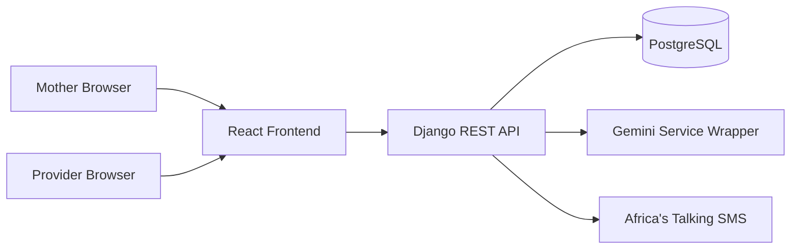
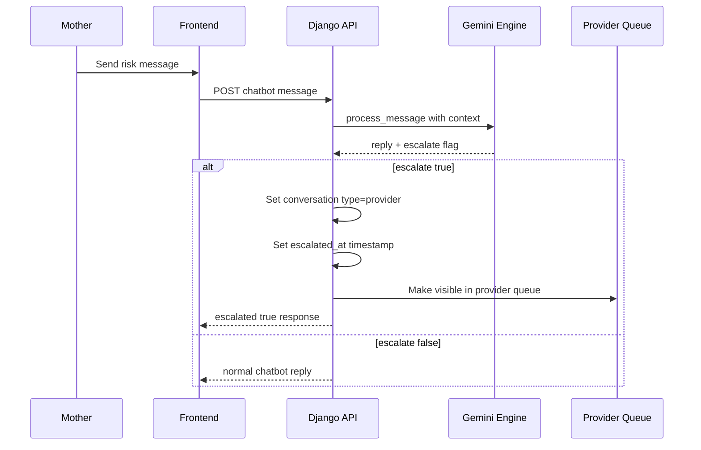

# Uzazi Safe Link Panel Presentation Guide

Author: Project Team  
Project: Uzazi Safe Link (Mimba Yangu)  
Type: Final Year Dissertation Project  
Institution: Ardhi University

---

## 1. How To Use This Document

This guide is written so you can present confidently in front of a panel from start to finish.

Use it in 3 modes:

1. Full presentation mode (15-25 minutes)
2. Fast pitch mode (3-5 minutes)
3. Q&A defense mode (after demo)

If you read this end-to-end and practice once, you should be able to explain:

- Why this project matters
- What exactly you built
- How it works technically
- Why your design decisions are strong
- What is complete, what is pending, and why

---

## 2. Executive Pitch (Use This At The Beginning)

Uzazi Safe Link is a web-based maternal health telemedicine system designed for Tanzania. It connects pregnant mothers and healthcare providers in one digital platform, enabling daily monitoring, AI-supported triage, direct provider communication, appointment workflow, and emergency escalation support.

The core value is continuity of care between clinic visits. A mother is not only seen at ANC day; she is supported every day through tracking, education, alerts, and provider follow-up.

This system solves three major gaps:

1. Limited real-time communication between mother and provider
2. Late detection of danger signs between visits
3. Weak digital continuity of maternal records and follow-up actions

---

## 3. Problem Statement

Maternal care in many settings still has workflow gaps:

- Mothers may notice warning signs at home but delay reporting
- Providers cannot continuously monitor all assigned mothers
- Follow-up actions (appointments, reminders, direct outreach) are fragmented
- Health education is inconsistent and often not personalized

Result:

- Higher risk of delayed intervention
- Poor appointment adherence
- Reduced care confidence for mothers

Uzazi Safe Link addresses this by creating one integrated digital care loop.

---

## 4. Objectives

### 4.1 Main Objective

Build a practical maternal telemedicine platform that supports safe pregnancy monitoring and provider engagement from onboarding to delivery preparation.

### 4.2 Specific Objectives

1. Provide secure mother and provider accounts with role-based access
2. Enable onboarding with hospital linkage for care routing
3. Support daily symptom and wellness tracking for mothers
4. Deliver educational maternal health tips in English and Swahili
5. Provide AI Health Assistant for first-line guidance
6. Escalate high-risk chat scenarios to provider queue
7. Enable direct two-way messaging between assigned mother and provider
8. Manage appointment request and confirmation workflow
9. Support SOS emergency trigger and provider alerting

---

## 5. Scope And Users

### 5.1 In Scope

- Two user roles: Mother (patient) and Provider
- Web platform (mobile-first responsive design)
- AI-assisted triage in maternal domain
- Appointment workflows and follow-up support
- Bilingual interface (EN/SW)

### 5.2 Out Of Scope (Current Version)

- Native Android/iOS app
- Video consultation module
- Dedicated hospital manager role dashboard
- Full prescription UI workflow (backend reminder logic exists, full UI flow is partial)

---

## 6. End-To-End User Journeys

## 6.1 Mother Journey

1. Register account
2. Select hospital during onboarding
3. Access home dashboard with pregnancy context
4. Track symptoms/mood and review timeline
5. Read weekly educational tips
6. Ask AI Health Assistant questions
7. If risk is detected, conversation is escalated to provider
8. Use direct chat with assigned provider
9. Request appointment
10. Trigger SOS in emergency and contact support lines

## 6.2 Provider Journey

1. Register as provider linked to hospital and specialization
2. View provider dashboard statistics and alerts
3. Receive escalated conversations from AI pipeline
4. Reply to escalated and direct conversations
5. Review assigned patients
6. Manage appointment requests (confirm/decline/propose)
7. Record ANC clinical visits and risk indicators

---

## 7. System Architecture

## 7.1 High-Level Architecture

### 7.2 Technology Stack

Backend:

- Django + Django REST Framework
- JWT authentication (SimpleJWT)
- Cookie-based refresh flow
- PostgreSQL (production), SQLite fallback for tests

Frontend:

- React + TypeScript + Vite
- Axios API layer
- i18next for bilingual support
- Leaflet maps and Recharts charts

Infrastructure:

- Backend deploy target: Render
- Frontend deploy target: Vercel

---

## 8. Data Model And Core Modules

Key backend modules:

1. accounts: user model, auth, password reset
2. patients: profile, onboarding, pregnancy context
3. hospitals: facilities and geolocation data
4. tracking: mood/symptom logs and timeline
5. appointments: request, confirm, decline, reschedule
6. chatbot: AI assistant conversation + escalation pipeline
7. chat: direct provider-patient messaging
8. emergency: SOS logging and alert workflow
9. notifications: in-app notification bell feeds
10. clinical: ANC visit records and risk evaluation

Important entities:

- User
- PatientProfile
- ProviderProfile
- Hospital
- Conversation and Message (chatbot escalation path)
- ChatRoom and Message (direct messaging path)
- Appointment
- ANCVisit
- Notification

---

## 9. Authentication And Security Design

Security was designed around practical production safety:

1. Access token in memory only (not persisted in local storage)
2. Refresh token in secure cookie flow
3. Session marker support to reduce unnecessary refresh noise
4. Role-based backend permissions for patient and provider actions
5. Request throttling on sensitive auth endpoints
6. Audit logging for sensitive actions
7. Environment secrets managed from env, not hardcoded

Why this matters in panel:

It shows your system is not just feature-complete but operationally secure.

---

## 10. AI Health Assistant Design

## 10.1 AI Strategy

The chatbot is Gemini-powered and contextual.

It receives:

- Current user message
- Limited conversation history
- Patient context block (week, risk, BP context, hospital)

It returns structured JSON:

- reply
- escalate true or false
- escalation_reason

## 10.2 Safety Layers

1. Prompt safety policy (maternal scope and emergency guidance)
2. Structured output schema validation
3. Rule-based danger-sign fallback keyword matcher
4. Dosage response sanitizer
5. Escalation notice enforcement for emergency responses

This layered design is a strong panel defense point because it demonstrates safety-by-design, not prompt-only dependence.

---

## 11. Escalation Pipeline (Critical Demo Story)

Provider queue fetches only conversations where:

- provider equals logged-in provider
- conversation type equals provider
- conversation is active

So escalation is not cosmetic; it changes data state and routing behavior.

---

## 12. Appointment Workflow

Mother-side:

- Creates appointment request status requested
- Provider can confirm or decline or propose new date/time

Provider-side:

- Can schedule directly for an assigned patient (auto-confirm path)

Important improvement in current code:

- Provider is prevented from using patient-only booking screen path that caused patient_id validation errors

---

## 13. Emergency SOS Workflow

Emergency flow goals:

1. Log alert event with context
2. Help mother call immediately
3. Notify provider through system channels
4. Show transparent status to user

Design principle:

Even when external SMS delivery is uncertain, the app still records emergency attempt and gives direct call actions so user is never blocked by third-party dependency status.

---

## 14. Bilingual And Accessibility Features

1. English and Swahili language switching
2. Persisted text size control (small, medium, large)
3. Dark mode support with persisted preference
4. Mobile-first layout with simplified controls

Panel value:

This is not only technical functionality, it is usability adaptation to diverse users.

---

## 15. Reliability And Operations

1. Idempotent management commands for scheduled tasks
2. Reminder jobs for appointments and medication workflows
3. Notification features for chat and appointment events
4. Deploy-friendly environment configuration
5. Cold-start-aware frontend retry for network-level failures

---

## 16. What Is Completed Vs What Is Partial

Completed:

- Core auth and role-based flows
- Mother tracking and provider dashboard
- AI chatbot and escalation queue
- Direct messaging between mother and provider
- Appointments request and provider actions
- SOS flow and emergency support UI

Partial or next-stage work:

- Full prescription UI pipeline end-to-end
- Native mobile app packaging
- Video consultation module
- Expanded analytics dashboards and longitudinal outcomes

---

## 17. Evidence Of Engineering Quality

1. Modular app structure by domain
2. Clear separation of chatbot AI logic, escalation side effects, and API views
3. Serializer-based validation and role checks
4. Test coverage in chat and permission-critical areas
5. Explicit migration history and management commands
6. Production-oriented behavior under dependency failures

---

## 18. Demo Script You Can Follow Live

## 18.1 Panel Demo Order (Recommended)

1. Open home and explain problem solved
2. Show patient onboarding and hospital selection
3. Show daily tracking and timeline
4. Open AI chat and send a danger-sign message
5. Switch to provider dashboard and show escalated queue update
6. Open escalated thread and provider response
7. Show appointment request and provider action path
8. Show SOS screen behavior and safety outputs
9. Close with architecture slide and future improvements

## 18.2 Demo Line You Can Say

This demonstrates a full closed-loop maternal care pathway from self-reporting to AI triage to provider intervention, with auditable transitions in system state.

---

## 19. Panel Q&A Master Section

Use these high-impact answers.

### Q1. Why not use a native mobile app?

Answer:

We prioritized rapid deployment and accessibility through a mobile-first web platform. This allows immediate access without store installation and supports iterative improvement during clinical workflow validation.

### Q2. How do you prevent unsafe AI medical advice?

Answer:

We use multi-layer safety controls: structured JSON output, emergency escalation flagging, independent danger-sign keyword fallback, dosage sanitization, and enforced emergency notice wording in escalation responses.

### Q3. What happens if Gemini is down?

Answer:

The system degrades gracefully with a clear service-unavailable response and still keeps emergency safety net checks active through rule-based escalation logic where applicable.

### Q4. How do providers avoid message overload?

Answer:

The system separates AI chat from direct messaging and provides an escalated queue that only contains high-risk handoff conversations assigned to that provider.

### Q5. How is data protected?

Answer:

Access tokens are kept in memory only, refresh handled via cookie strategy, role-based authorization is enforced server-side, and sensitive operations are rate-limited and auditable.

### Q6. What is your innovation compared to simple reminder apps?

Answer:

This is a decision-support communication platform with closed-loop escalation, not only reminders. It links patient context, AI triage, provider workflow, and operational follow-up in one integrated architecture.

### Q7. What are your measurable outcomes in future evaluation?

Answer:

We can measure response time to danger-sign reports, appointment adherence rates, escalation-to-provider action times, and user retention in daily tracking and educational modules.

---

## 20. 3-Minute Competitive Pitch Version

Use this when panel asks for short summary.

Uzazi Safe Link is a maternal telemedicine platform for Tanzania that continuously connects pregnant mothers and healthcare providers between ANC visits. The system combines daily health tracking, bilingual education, appointment workflows, emergency support, direct chat, and a Gemini-powered health assistant with safety-focused escalation.

When a mother reports danger signs, the conversation is automatically converted from chatbot mode to provider mode and appears in the provider escalated queue with notification side effects. This creates a practical, auditable handoff from digital triage to human care.

Technically, the project uses React TypeScript frontend, Django REST backend, secure role-based access, context-aware AI processing, and modular domain apps. The result is an end-to-end closed loop for maternal continuity of care, designed for real operational constraints and incremental scaling.

---

## 21. Final Closing Statement

This project is not just a prototype screen collection. It is a clinically oriented workflow system that translates maternal health needs into an implementable, secure, and extensible digital platform.

If approved for next phase, the highest-impact expansion is deeper prescription workflows, stronger offline-first behavior, and outcomes-driven analytics for providers and health programs.

---

## 22. Presenter Checklist Before Panel Day

1. Confirm backend and frontend both run cleanly
2. Confirm provider and patient test accounts are ready
3. Seed at least one escalated conversation for fallback demo
4. Prepare one danger-sign message for live AI escalation demo
5. Verify hospital records exist for onboarding flow
6. Verify dark mode and text-size toggles are visible
7. Keep one backup script for no-internet or SMS-gateway issue

---

End of guide.
