# Uzazi Safe Link (Mimba Yangu) — Project Summary

*Final Year Dissertation Project — Ardhi University*
*A Web-Based Telemedicine System for Maternal Health and Pre-Natal Care*

---

## 1. Overview

Uzazi Safe Link (branded in-app as **"Mimba Yangu"**, Swahili for "My Pregnancy") is a
full-stack telemedicine web application designed to support pregnant women in Tanzania
throughout their antenatal journey. It connects **mothers**, their **partners**, **healthcare
providers** (doctors/midwives/nurses), and **hospital managers** on a single platform that
combines self-monitoring tools, an AI health assistant, direct provider messaging,
appointment scheduling, clinical risk assessment, and emergency (SOS) response — with
full bilingual support (English / Swahili).

The system is built as two independently deployable applications:

| Layer | Technology | Role |
|---|---|---|
| **Backend** | Django REST Framework (Python) | REST API, business logic, data persistence, background jobs |
| **Frontend** | React + TypeScript + Vite | Mobile-first single-page web app (PWA-style UI) |

---

## 2. Problem Statement / Motivation

Maternal mortality and preventable pregnancy complications remain a significant public
health challenge in Tanzania, driven partly by delayed recognition of danger signs, poor
continuity of antenatal care (ANC) visit tracking, and limited access to timely medical
guidance — especially outside clinic hours. Uzazi Safe Link addresses this by:

- Giving mothers a 24/7 AI-powered health assistant for maternal-health questions.
- Digitising ANC visit records and applying **WHO-aligned automatic risk scoring**.
- Enabling direct chat/escalation between a mother and her assigned provider when a
  situation needs human judgement.
- Providing one-tap emergency (SOS) alerts with location sharing to providers and
  emergency contacts.
- Sending automated SMS/appointment/medication reminders to reduce missed ANC visits
  and improve medication adherence.
- Making all patient-facing content available in both English and Swahili.

---

## 3. System Architecture

```
┌─────────────────────────┐        HTTPS / REST (JSON)        ┌──────────────────────────┐
│   React + TS Frontend   │ ─────────────────────────────────▶│  Django REST Framework    │
│   (Vercel static build) │◀───────────────────────────────── │  Backend API (Render)     │
│                         │        JWT Bearer auth             │                          │
└─────────────────────────┘                                    │  ┌────────────────────┐  │
                                                                 │  │ SQLite (dev) /     │  │
                                                                 │  │ PostgreSQL (prod)  │  │
                                                                 │  └────────────────────┘  │
                                                                 │  ┌────────────────────┐  │
                                                                 │  │ Google Gemini API  │  │
                                                                 │  │ (AI chat engine)   │  │
                                                                 │  └────────────────────┘  │
                                                                 │  ┌────────────────────┐  │
                                                                 │  │ Africa's Talking   │  │
                                                                 │  │ (SMS gateway)      │  │
                                                                 │  └────────────────────┘  │
                                                                 │  ┌────────────────────┐  │
                                                                 │  │ Gmail SMTP         │  │
                                                                 │  │ (email OTP/notify) │  │
                                                                 │  └────────────────────┘  │
                                                                 └──────────────────────────┘
```

The frontend talks exclusively to the backend over a versioned REST API secured with
JWT access/refresh tokens (`djangorestframework_simplejwt`). The backend is organised
as a set of Django "apps," each owning one bounded domain (see §6). Scheduled/background
work (SMS reminders, missed-appointment sweeps) runs as idempotent Django management
commands, intended to be triggered by an external scheduler (cron / Windows Task
Scheduler) rather than an in-process task queue — a pragmatic choice for a
dissertation-scale deployment that avoids adding Celery/Redis infrastructure.

**Deployment:** the frontend deploys to **Vercel** as a static SPA build (`frontend/vercel.json`
rewrites all routes to `index.html` for client-side routing); the backend deploys to
**Render** (`render.yaml`) as a `gunicorn`-served web service with a managed PostgreSQL
database, `whitenoise` for static file serving, and all secrets (Gemini/SMS/SMTP keys,
`SECRET_KEY`) injected as environment variables rather than committed to source.

---

## 4. Technology Stack

### 4.1 Backend
| Technology | Version | Purpose |
|---|---|---|
| Python | 3.12 | Language runtime |
| Django | 4.2.30 | Web framework / ORM |
| Django REST Framework | 3.17.1 | REST API layer (serializers, viewsets, permissions) |
| djangorestframework-simplejwt | 5.5.1 | JWT-based authentication (access + refresh tokens) |
| django-cors-headers | 4.9.0 | CORS handling for the separate frontend origin |
| python-decouple | 3.8 | `.env`-based configuration/secrets management |
| SQLite | — | Development database (`db.sqlite3`) |
| PostgreSQL (via `dj-database-url` + `psycopg2-binary`) | 3.1.2 / 2.9.10 | Production database on Render, selected automatically when `DATABASE_URL` is set |
| gunicorn | 26.0.0 | Production WSGI server (Render `startCommand`) |
| whitenoise | 6.12.0 | Static file serving in production without a separate CDN/web server |
| google-genai | 2.10.0 | Official Google Gemini SDK — powers the AI Health Assistant |
| africastalking | 2.0.2 | SMS gateway SDK (OTP codes, appointment/medication reminders, emergency alerts) |
| argon2-cffi | 25.1.0 | Password hashing backend |
| PyJWT | 2.13.0 | JWT token encode/decode (used by simplejwt) |
| cryptography | 48.0.0 | Cryptographic primitives (TLS, JWT signing support) |
| requests / httpx | — | Outbound HTTP for third-party API calls |
| Jupyter / ipykernel / matplotlib / pandas-adjacent tooling | — | Present in the environment for ad-hoc data analysis/notebooks during development (not part of the runtime API) |

### 4.2 Frontend
| Technology | Version | Purpose |
|---|---|---|
| React | 19.2.6 | UI library |
| TypeScript | ~6.0.2 | Static typing |
| Vite | 8.0.12 | Dev server & build tool |
| React Router DOM | 7.15.1 | Client-side routing (`PrivateRoute` guards, nested routes) |
| @tanstack/react-query | 5.100.14 | Server-state fetching/caching |
| Axios | 1.16.1 | HTTP client for the REST API |
| Tailwind CSS | 3.4.19 | Utility-first styling |
| Leaflet + react-leaflet | 1.9.4 / 5.0.0 | Interactive maps (hospital selection, hospital locator) |
| Recharts | 3.8.1 | Charts (mood/symptom timeline, health trends) |
| i18next + react-i18next | — | Bilingual (English/Swahili) internationalisation |
| lucide-react | — | Icon set |
| ESLint + typescript-eslint | — | Linting |

### 4.3 External Services / Integrations
- **Google Gemini** (`gemini-2.5-flash`) — conversational AI for the Health Assistant chatbot, called via `backend/services/gemini_service.py`.
- **Africa's Talking** — SMS delivery for OTP verification, appointment reminders, medication reminders, and emergency SOS alerts (sandbox mode by default).
- **Gmail SMTP** — email-based OTP/notifications (`django.core.mail` SMTP backend).

### 4.4 Tooling
- **Version control:** Git
- **Package management:** pip (backend), npm (frontend)
- **Environment config:** `.env` files (backend and frontend), loaded via `python-decouple` and Vite's built-in `import.meta.env`

---

## 5. User Roles

The system supports four distinct user types on one `User` model
(`user_type` field), each with role-specific dashboards:

| Role | Description | Key Frontend Views |
|---|---|---|
| **Patient (Mother)** | Primary end-user; tracks pregnancy, symptoms, appointments | Home, Track, Timeline, Learn, Appointments, Chat, Emergency, Profile |
| **Partner** | Linked to a patient via an invitation code; supportive access | Partner Support page |
| **Provider** | Doctor/midwife/nurse assigned to patients at a hospital | Provider Dashboard, Provider Chat Queue, ANC Visit Modal |
| **Hospital Manager** | Oversees a hospital's providers/content | Manager Dashboard |

Authentication is **phone-number based** (not email/username), reflecting the target
demographic's primary contact channel. All non-public routes are protected client-side
by a `PrivateRoute` component and server-side by DRF permission classes tied to the JWT.

---

## 6. Backend Modules (Django Apps)

| App | Responsibility |
|---|---|
| **accounts** | Custom `User` model (phone-based auth), `ProviderProfile`, `HospitalManagerProfile`, OTP codes, partner-linking, SMS/email OTP delivery, login/register/reset-password views |
| **patients** | `PatientProfile` (pregnancy status, LMP/due date, weight/height, hospital, preferences), `BabyGrowth` (week-by-week fetal development content), `ANCMilestone` reference data, onboarding/skip-onboarding logic |
| **hospitals** | `Hospital` model (name, type, geo-coordinates, services) with seed fixtures; location-based hospital search |
| **appointments** | `Appointment` model (visit type, date/time, provider, hospital, status, reminder-sent flags); bookable either by a **patient** (auto-resolves her own assigned provider) or directly by a **provider** on behalf of one of her own mothers (`ScheduleAppointmentModal` on the Provider Dashboard — the provider path validates the target patient is actually assigned to them before creating the row); double-booking is rejected at both the application and DB (`unique_together`) level; management commands handle automated SMS reminders and "mark missed" sweeps |
| **tracking** | `MoodLog` (daily mood 1–5, symptoms, weight, baby kicks — one per user per day), `Symptom` reference list, `SymptomReport` with AI/rule-based risk scoring |
| **clinical** | `ANCVisit` — the clinical record captured by a provider during an in-person visit (vitals, labs, obstetric exam), with a built-in **WHO-aligned automatic risk-assessment engine** (`evaluate_risk()`) and rule-based recommendation generator (`generate_recommendations()`) |
| **tips** | `TipCategory` / `Tip` — bilingual educational content, filterable by trimester, with AI-generation + medical-review + manager-approval workflow before mothers can see it; `Bookmark` for saved tips. The patient-facing Learn page actually reads from a separate top-level `backend/learn_views.py` (`GET/POST /api/learn/articles/`), which serves the same `Tip` rows filtered by `is_approved`. Its six category tabs (What to Do / What to Avoid / Warning Signs / Hormonal Changes / Birth Prep / Nutrition & Food) are matched **client-side** against each tip's title/type text, not a DB relation — `tips/management/commands/seed_tips.py` seeds 24 bilingual, pre-approved tips (4 per category) with titles written to match those tabs |
| **chat** | Direct **mother ↔ provider** messaging: `ChatRoom`, `Message`, and a `VideoConsultation` model (video-call session tracking). Wired into the UI on both sides — a provider starts a thread from a patient's profile panel on the dashboard, and can browse/reply to all their direct threads from a "Direct" tab in `ProviderChatQueue.tsx`; mothers see the same thread under a "My Provider" tab in `ChatPage.tsx`, alongside the AI Assistant tab |
| **chatbot** | AI Health Assistant: `Conversation` + `Message` (new Gemini-driven schema) plus a legacy `ChatSession`/`BotMessage` state-machine kept for backward compatibility; auto-escalates a chatbot conversation to a live provider when needed |
| **emergency** | One-tap SOS: `EmergencyContact`, `EmergencyLog` (action taken, GPS coordinates, SMS-sent flag, which provider was notified), bilingual `EmergencyInstruction` content |
| **medication** | `Prescription` (issued by a provider) and `MedicationReminder` (scheduled SMS dose reminders with delivery-status tracking) |
| **maintenance** | `AuditLog` (login/security/data-change events) and `SystemMaintenance` (backup status, DB size, server health) — operational/admin observability |
| **services** | Shared integration layer — currently `gemini_service.py`, the single place that talks to the Gemini SDK (client caching, key lookup, `generate_text()` helper used by both the chatbot and other AI-assisted features) |

---

## 7. Database Design (Key Models)

- **User** *(accounts)* — phone-based `AbstractBaseUser`; `user_type` ∈ {patient, partner, provider, hospital_manager}; verification + staff flags.
- **PatientProfile** *(patients)* — 1:1 with User; pregnancy status/dates, computed `pregnancy_week()` / `trimester()`, hospital FK, accessibility preferences (font size, audio guidance).
- **ProviderProfile** *(accounts)* — 1:1 with User; specialization, hospital FK, workload capacity tracking (`current_workload` / `max_workload`) for patient-assignment logic.
- **Hospital** *(hospitals)* — name, type (public/private/maternity), services, geo-coordinates.
- **Appointment** *(appointments)* — patient, provider, hospital, visit type, date/time, status, 48h/2h SMS reminder flags; unique constraint prevents double-booking a provider's slot.
- **MoodLog** *(tracking)* — one row per user per calendar day (`unique_together`), mood score, symptom list, optional weight/baby-kicks.
- **ANCVisit** *(clinical)* — the richest clinical model: BP, weight, fundal height, fetal heart rate, urine protein/glucose, hemoglobin, blood group, HIV/syphilis status, free-text symptoms/notes, and **auto-computed** `risk_level` + `risk_reasons` (via WHO-aligned thresholds) + `recommendations`, recalculated on every save unless a provider manually overrides the risk level. Its provider-facing form (`ANCVisitModal.tsx`) surfaces a visible banner naming the missing required Vitals fields (patient, weight, BP, gestational age) when a save is blocked, rather than silently scrolling back to the Vitals tab with no explanation.
- **Conversation / Message** *(chatbot)* — Gemini-backed chat thread that can flip from `type='chatbot'` to `type='provider'` on escalation, preserving full history across the switch.
- **ChatRoom / Message / VideoConsultation** *(chat)* — direct provider messaging, separate from the AI chatbot thread.
- **Prescription / MedicationReminder** *(medication)* — dosage/frequency/duration plus scheduled SMS reminders with acknowledgement tracking.
- **EmergencyLog / EmergencyContact** *(emergency)* — SOS action audit trail with GPS coordinates and which provider was alerted.
- **Tip / TipCategory / Bookmark** *(tips)* — bilingual content with an `is_approved` gate so AI-generated or draft tips never reach mothers unreviewed.
- **AuditLog / SystemMaintenance** *(maintenance)* — security/audit trail and basic ops health snapshot.

All patient-facing text models carry bilingual field pairs (e.g. `title` / `title_sw`,
`description` / `description_sw`) rather than using a separate translation table —
a deliberate simplicity trade-off for a two-language system.

---

## 7.1 Entity-Relationship Diagram

The diagram below covers all 28 active models across the 13 Django apps. Two legacy
models (`chatbot.ChatSession`, `chatbot.BotMessage`) are omitted — they are a
pre-Gemini state-machine chatbot kept only so old rows still resolve, and are not
part of the current data flow (see §8). `chat.Message` and `chatbot.Message` share a
name in code but are renamed `CHAT_MESSAGE` / `AI_MESSAGE` below to disambiguate.

> Paste the block below into the [Mermaid Live Editor](https://mermaid.live) (or a
> Mermaid-enabled Markdown viewer / VS Code extension) to render and export a PNG/SVG
> for the dissertation document.

```mermaid
erDiagram
    USER {
        int id PK
        string phone_number
        string email
        string full_name
        string user_type
        date date_of_birth
        bool is_verified
        bool is_staff
        datetime created_at
    }

    PROVIDER_PROFILE {
        int id PK
        int user_id FK
        int hospital_id FK
        string specialization
        bool is_available
        int max_workload
        int current_workload
    }

    HOSPITAL_MANAGER_PROFILE {
        int id PK
        int user_id FK
        int hospital_id FK
        datetime created_at
    }

    OTP_CODE {
        int id PK
        int user_id FK
        string code
        datetime created_at
        bool is_used
    }

    PARTNER_LINK {
        int id PK
        int patient_id FK
        int partner_id FK
        string partner_phone
        string invitation_code
        bool is_confirmed
    }

    PATIENT_PROFILE {
        int id PK
        int user_id FK
        int assigned_provider_id FK
        int hospital_id FK
        string pregnancy_status
        date lmp_date
        date due_date
        float weight_kg
        float height_cm
        bool onboarding_completed
        string language
    }

    BABY_GROWTH {
        int id PK
        int week
        string title
        string description
        float length_cm
        float weight_g
    }

    ANC_MILESTONE {
        int id PK
        int week
        string title
        string description
    }

    HOSPITAL {
        int id PK
        string name
        string type
        string services
        float latitude
        float longitude
        bool is_active
    }

    APPOINTMENT {
        int id PK
        int user_id FK
        int provider_id FK
        int hospital_id FK
        string visit_type
        date appointment_date
        time appointment_time
        string status
        bool reminder_48h_sent
        bool reminder_2h_sent
    }

    SYMPTOM {
        int id PK
        string name
        bool is_danger_sign
    }

    MOOD_LOG {
        int id PK
        int user_id FK
        int mood
        json symptoms
        float weight_kg
        int baby_kicks
        date date
    }

    SYMPTOM_REPORT {
        int id PK
        int patient_id FK
        string additional_notes
        string risk_level
        bool is_reviewed
        datetime created_at
    }

    ANC_VISIT {
        int id PK
        int patient_id FK
        int provider_id FK
        datetime visit_date
        float weight_kg
        int blood_pressure_systolic
        int blood_pressure_diastolic
        int gestational_age_weeks
        float hemoglobin_g_dl
        string risk_level
        json risk_reasons
        json recommendations
    }

    TIP_CATEGORY {
        int id PK
        string name
        string color
    }

    TIP {
        int id PK
        int category_id FK
        string title
        string tip_type
        string trimester
        bool is_ai_generated
        bool is_approved
    }

    BOOKMARK {
        int id PK
        int user_id FK
        int tip_id FK
        datetime saved_at
    }

    CHAT_ROOM {
        int id PK
        int patient_id FK
        int provider_id FK
        bool is_active
        datetime created_at
    }

    CHAT_MESSAGE {
        int id PK
        int room_id FK
        int sender_id FK
        string text
        bool is_read
        datetime created_at
    }

    VIDEO_CONSULTATION {
        int id PK
        int room_id FK
        string meeting_id
        datetime start_time
        bool is_active
    }

    CONVERSATION {
        int id PK
        int mother_id FK
        int provider_id FK
        string type
        datetime escalated_at
        bool is_active
    }

    AI_MESSAGE {
        int id PK
        int conversation_id FK
        int sender_id FK
        string sender_type
        string content
        bool triggered_escalation
        datetime created_at
    }

    EMERGENCY_CONTACT {
        int id PK
        int user_id FK
        string name
        string phone_number
        bool is_primary
    }

    EMERGENCY_LOG {
        int id PK
        int user_id FK
        int provider_notified_id FK
        string action
        float latitude
        float longitude
        bool is_sms_sent
        datetime triggered_at
    }

    EMERGENCY_INSTRUCTION {
        int id PK
        string title
        string body
        int order
    }

    PRESCRIPTION {
        int id PK
        int patient_id FK
        int provider_id FK
        string medication_name
        string dosage
        string frequency
        int duration_days
        bool is_active
        date start_date
    }

    MEDICATION_REMINDER {
        int id PK
        int prescription_id FK
        datetime scheduled_time
        bool is_sent
        bool is_acknowledged
        string sms_status
    }

    AUDIT_LOG {
        int id PK
        int user_id FK
        string event_type
        string description
        string ip_address
        datetime timestamp
    }

    SYSTEM_MAINTENANCE {
        int id PK
        datetime last_backup_at
        string backup_status
        float db_size_mb
        string server_status
    }

    USER ||--o| PROVIDER_PROFILE : "is (if provider)"
    USER ||--o| HOSPITAL_MANAGER_PROFILE : "is (if manager)"
    USER ||--o| PATIENT_PROFILE : "is (if patient)"
    USER ||--o{ OTP_CODE : "receives"
    USER ||--o| PARTNER_LINK : "linked as patient"
    USER |o--o{ PARTNER_LINK : "linked as partner"
    HOSPITAL ||--o{ PROVIDER_PROFILE : "employs"
    HOSPITAL ||--o{ HOSPITAL_MANAGER_PROFILE : "managed by"
    HOSPITAL |o--o{ PATIENT_PROFILE : "chosen by"
    HOSPITAL |o--o{ APPOINTMENT : "hosts"
    PROVIDER_PROFILE |o--o{ PATIENT_PROFILE : "assigned to"
    USER ||--o{ APPOINTMENT : "books (patient)"
    USER |o--o{ APPOINTMENT : "attends (provider)"
    USER ||--o{ MOOD_LOG : "logs"
    USER ||--o{ SYMPTOM_REPORT : "submits"
    SYMPTOM }o--o{ SYMPTOM_REPORT : "reported in"
    USER ||--o{ ANC_VISIT : "receives (patient)"
    USER ||--o{ ANC_VISIT : "conducts (provider)"
    TIP_CATEGORY ||--o{ TIP : "groups"
    USER ||--o{ BOOKMARK : "saves"
    TIP ||--o{ BOOKMARK : "saved as"
    USER ||--o{ CHAT_ROOM : "opens (patient)"
    USER ||--o{ CHAT_ROOM : "staffs (provider)"
    CHAT_ROOM ||--o{ CHAT_MESSAGE : "contains"
    CHAT_ROOM ||--o| VIDEO_CONSULTATION : "hosts"
    USER ||--o{ CHAT_MESSAGE : "sends"
    USER ||--o{ CONVERSATION : "starts (mother)"
    USER |o--o{ CONVERSATION : "joins (provider)"
    CONVERSATION ||--o{ AI_MESSAGE : "contains"
    USER |o--o{ AI_MESSAGE : "sends"
    USER ||--o{ EMERGENCY_CONTACT : "lists"
    USER ||--o{ EMERGENCY_LOG : "triggers"
    USER |o--o{ EMERGENCY_LOG : "is notified (provider)"
    USER ||--o{ PRESCRIPTION : "receives (patient)"
    USER ||--o{ PRESCRIPTION : "issues (provider)"
    PRESCRIPTION ||--o{ MEDICATION_REMINDER : "schedules"
    USER |o--o{ AUDIT_LOG : "performs"
```



`BABY_GROWTH`, `ANC_MILESTONE`, `EMERGENCY_INSTRUCTION`, and `SYSTEM_MAINTENANCE` are
intentionally disconnected from `USER` — they are reference/content tables (fetal
development facts, ANC milestone schedule, SOS instructions, and a singleton system
health snapshot) rather than per-user records.

---

## 8. Key Feature: AI Health Assistant (Gemini Integration)

- **Model:** `gemini-2.5-flash` (configurable via `GEMINI_MODEL` env var).
- **Integration point:** `backend/services/gemini_service.py` (SDK setup, key lookup, client caching, `generate_text()`) is consumed by `backend/chatbot/ai_engine.py` (chat-domain logic and system prompt).
- **Behaviour:**
  - Detects and mirrors the user's language per-message — pure English, pure Swahili, or natural code-switching between the two.
  - Receives the **full conversation history** each turn so it remembers earlier-reported symptoms.
  - Is given a **PATIENT CONTEXT block** (name, pregnancy week/trimester, latest BP/risk level, assigned hospital) to personalise every reply without reading the context back verbatim.
  - Uses **structured JSON output** (`{reply, escalate, escalation_reason}`) so escalation decisions are deterministic rather than parsed from free text.
  - On escalation, the `Conversation.type` flips from `chatbot` to `provider` and a human provider joins the same thread — the mother never loses context.
  - **Graceful degradation:** if the SDK isn't installed or `GEMINI_API_KEY` is unset/invalid, the engine returns a clearly-marked "service unavailable" message rather than a hallucinated or keyword-bot answer. Status is exposed via `GET /api/chatbot/status/` → `{ai_available, model}`.

---

## 9. Key Feature: Clinical Risk Assessment Engine

Implemented in `clinical/models.py::ANCVisit.evaluate_risk()`, this is a **rule-based
(non-AI) expert system** aligned to WHO antenatal-care guidelines. On every save it
inspects:

1. Blood pressure (systolic ≥140 / diastolic ≥90 → hypertension flag)
2. Hemoglobin < 11 g/dL → anemia
3. Multiple pregnancy
4. Maternal age < 18 or > 35 (adolescent / advanced maternal age)
5. Previous pregnancy complications (from the patient's profile history)
6. Urine protein / glucose trace levels (preeclampsia / gestational diabetes signals)
7. Fetal heart rate outside 110–160 bpm
8. Danger-sign keyword matching in free-text symptoms (bilingual EN/SW keyword list, e.g. "severe headache" / "maumivu makali ya kichwa")
9. Selected complication category

Any match sets `risk_level='high'` with human-readable `risk_reasons`; borderline values
(e.g. systolic 130–139) fall to `medium`; otherwise `low`. A parallel
`generate_recommendations()` method produces structured, provider-facing alerts/actions
(e.g. "Anemia Management — prescribe iron/folic acid, follow-up blood test in 2 weeks").
Providers can manually override the computed risk level when clinical judgement
disagrees with the automated assessment.

---

## 10. Notifications & Scheduled Jobs

All background work is implemented as **idempotent Django management commands** (no
Celery/Redis dependency), meant to be invoked periodically by an external scheduler:

```bash
python manage.py run_scheduled_tasks   # omnibus command, run every 15–30 min
```

Individually:
- `send_appointment_reminders [--hours] [--mark-missed]` — 48h/2h-before SMS reminders and automatic "missed" status marking for past-due appointments.
- `send_medication_reminders` — SMS dose reminders for active prescriptions.

Delivery goes through Africa's Talking; each reminder tracks its own sent/acknowledged
state so re-running the command never double-sends.

---

## 11. Security & Auth

- **JWT authentication** (access + refresh tokens) via `djangorestframework_simplejwt`, with rotation and blacklist-after-rotation enabled. The access token is kept **in memory only** (`frontend/src/api/tokenStore.ts`) — never written to `localStorage` — so it cannot be lifted by an XSS payload; the refresh token travels in an **httpOnly, SameSite cookie** the browser manages and JavaScript never sees. On a full page reload the in-memory access token is lost by design, and `AuthContext` silently exchanges the refresh cookie for a new one on app start; that bootstrap request is cached at module scope so React StrictMode's dev-only double-effect can't fire it twice concurrently, and `CookieTokenRefreshView` also treats a losing concurrent rotation as a clean 401 rather than an unhandled `IntegrityError`.
- **Phone-number-based login** with Argon2 password hashing (`argon2-cffi`).
- **OTP verification** for registration/password-reset, delivered by SMS (Africa's Talking) and/or email (Gmail SMTP), with a 10-minute expiry window (`OTPCode.is_expired()`).
- **CORS** explicitly configured (`django-cors-headers`) to allow only the known frontend origin.
- **Role-based access**: DRF permission classes gate endpoints by `user_type` (e.g. only providers can write `ANCVisit` records; only managers approve `Tip` content).
- **Audit logging** (`maintenance.AuditLog`) captures login attempts, failed logins, data changes, and security alerts with IP/user-agent metadata.
- Secrets (API keys, SMTP credentials, `SECRET_KEY`) are kept out of source control via `.env` (loaded with `python-decouple`), with `.env.example` documenting required variables.

---

## 12. Bilingual Support & Localisation

- Backend: nearly every patient-facing content model stores parallel English/Swahili fields (`title`/`title_sw`, `description`/`description_sw`, etc.) rather than a generic translation table.
- Frontend: `i18next` + `react-i18next` with browser language auto-detection.
- The Gemini chatbot detects and replies in the user's message language per-turn (including natural Swahili/English code-switching), independent of the UI's selected language.
- Timezone: `Africa/Dar_es_Salaam` (UTC+3) is the system-wide default.

---

## 13. Frontend Pages / Routes (by role)

| Page | Route (indicative) | Audience |
|---|---|---|
| Splash | `/` | All (unauthenticated landing) |
| Onboarding wizard | `/onboarding/*` | New users (multi-step signup, hospital selection) |
| Login | `/login` | All |
| Password reset request/confirm | `/password-reset/*` | All |
| Home + Baby Growth | `/home`, baby growth sub-view | Patient |
| Track (mood/symptom log) + Contraction Timer | `/track` | Patient |
| Timeline (charts/history) | `/timeline` | Patient |
| Learn (tips library) | `/learn` | Patient |
| Appointments | `/appointments` | Patient |
| Chat (AI assistant / provider) | `/chat` | Patient |
| Emergency (SOS) | `/emergency` | Patient |
| Profile, Settings, Preferences, Hospital Map, Partner Support | `/profile/*` | Patient (+ Partner) |
| Provider Dashboard, Chat Queue, ANC Visit form | Provider-only routes | Provider |
| Manager Dashboard | Manager-only route | Hospital Manager |

Every route beyond the public onboarding/login/splash pages is wrapped in a
`PrivateRoute` guard that checks the authenticated user object before rendering.

---

## 14. API Surface (selected endpoints)

| Method | Endpoint | Purpose |
|---|---|---|
| POST | `/api/auth/register/` | Create account |
| POST | `/api/auth/login/` | Password login → JWT pair |
| POST | `/api/auth/send-otp/` | Resend verification code |
| POST | `/api/auth/password-reset/request/` `/confirm/` | SMS/email-based password reset |
| GET | `/api/auth/me/` | Current authenticated user |
| GET/PATCH | `/api/patients/profile/` | Patient profile (incl. hospital selection → onboarding complete) |
| GET | `/api/patients/pregnancy-info/` | Current week & trimester |
| GET | `/api/patients/baby-growth/` | Weekly fetal development content |
| GET | `/api/hospitals/?lat=&lng=` | Nearby hospitals |
| GET/POST | `/api/tracking/` , `/api/tracking/timeline/` | Mood/symptom logs and 7-day history |
| GET/POST | `/api/appointments/` | ANC appointments — patient self-booking (auto-resolves her assigned provider) or provider booking on behalf of an assigned patient (`patient_id` in payload) |
| GET | `/api/tips/` , `/api/tips/categories/` , `/api/tips/saved/` | Educational content (management/bookmark surface) |
| GET/POST | `/api/learn/articles/` | Canonical patient-facing Learn feed the frontend actually reads (same `Tip` rows, filtered by `?trimester=`) |
| POST | `/api/tips/{id}/bookmark/` | Toggle saved tip |
| POST | `/api/emergency/log/` | Log SOS action |
| GET/POST | `/api/chat/rooms/` , `/api/chat/rooms/<id>/messages/` , `/api/chat/rooms/<id>/mark-read/` | Provider ↔ patient direct chat — provider-initiated, wired into `ProviderChatQueue.tsx` ("Direct" tab) and `ChatPage.tsx` ("My Provider" tab) |
| GET | `/api/chatbot/status/` | AI availability probe |

*(Full endpoint list in `README.md`.)*

---

## 15. Summary Table — Technologies at a Glance

**Languages:** Python, TypeScript, JavaScript, HTML, CSS
**Backend framework:** Django 4.2 + Django REST Framework
**Frontend framework:** React 19 + Vite 8
**Database:** SQLite (development), PostgreSQL (production, via Render)
**Auth:** JWT (SimpleJWT) + Argon2 password hashing, phone-number identity
**AI/ML:** Google Gemini (`gemini-2.5-flash`) via `google-genai` SDK
**Messaging:** Africa's Talking (SMS), Gmail SMTP (email)
**Mapping:** Leaflet / react-leaflet
**Charting:** Recharts
**i18n:** i18next (English/Swahili)
**State/data-fetching:** TanStack React Query, Axios
**Styling:** Tailwind CSS
**Background jobs:** Django management commands (cron/Task-Scheduler-driven, no Celery)
**Dev tooling:** ESLint, TypeScript compiler, pip/npm
**Deployment:** Vercel (frontend static build), Render (backend + managed Postgres, via `render.yaml`)

---

*This document was generated to support the dissertation write-up and reflects the
codebase as of 2026-07-06.*
